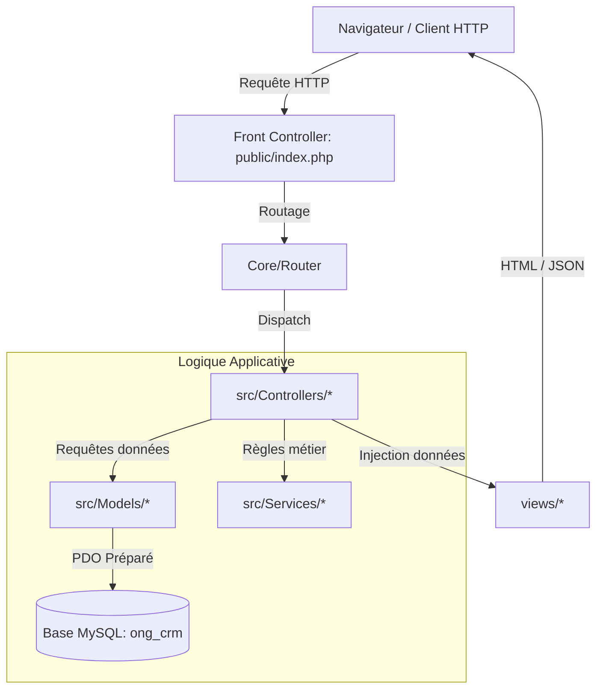

# 🏛 Architecture Technique & Bonnes Pratiques — ONG & CRM

Ce document présente l'architecture logicielle de la plateforme **Site Web ONG & CRM**, les choix de conception retenus en **PHP moderne** et les règles de sécurité appliquées.

---

## 1. Principes d'Architecture

L'application repose sur le patron de conception **MVC (Modèle - Vue - Contrôleur)** complété par une couche **Services** pour isoler la logique métier complexe :

### Avantages de cette conception :
1. **Séparation nette des responsabilités** : Le code SQL ne se mélange jamais avec les balises HTML ou la logique de redirection.
2. **Isolation du DocumentRoot (`public/`)** : Seul le répertoire `public/` est accessible depuis le navigateur web. Les dossiers sensibles (`src/`, `config/`, `.env`, `database/`) sont inaccessibles directement, empêchant les fuites de code source.
3. **Autonomie complète sans dépendances obligatoires** : Un autoloader PSR-4 natif (`App\Core\Autoloader`) permet d'exécuter l'application sur n'importe quel hébergement PHP 8+ sans obliger à exécuter `composer install`.
4. **Extensibilité** : L'ajout de nouveaux modules (ex: module e-boutique solidaire, SMS gateway) se fait en créant simplement un Contrôleur, un Modèle et une Vue sans altérer le cœur applicatif.

---

## 2. Le Cœur du Framework (`src/Core/`)

| Composant | Rôle et Responsabilité |
|---|---|
| `Autoloader.php` | Charge automatiquement toutes les classes du namespace `App\` selon la norme PSR-4. |
| `Router.php` | Résout les routes HTTP GET et POST, extrait les paramètres dynamiques (`{id}`, `{ref}`). |
| `Request.php` | Encapsule les superglobales (`$_GET`, `$_POST`, corps JSON) et filtre les entrées utilisateur. |
| `Response.php` | Fournit les helpers de redirection HTTP, de codes de statut et de réponses JSON. |
| `Database.php` | Singleton PDO assurant une unique connexion MySQL par cycle de requête avec encodage `utf8mb4`. |
| `Model.php` | Classe mère d'accès aux données avec requêtes préparées (`find`, `where`, `create`, `update`, `delete`). |
| `Controller.php` | Classe mère offrant le moteur de rendu avec layouts (`main`, `admin`, `auth`), CSRF et sessions. |
| `Session.php` | Gestionnaire de session sécurisé (`httponly`, `samesite`), messages flash et jetons CSRF. |
| `Auth.php` | Gestionnaire d'authentification CRM avec vérification RBAC des rôles et hachage sécurisé `password_hash()`. |

---

## 3. Sécurité Applicative

### A. Protection contre les Injections SQL
Toutes les interactions avec MySQL s'effectuent via **PDO et des requêtes préparées avec paramètres nommés** (`:id`, `:email`, `:montant`). Aucune variable utilisateur n'est directement concaténée dans une chaîne SQL.

### B. Protection contre les attaques CSRF (Cross-Site Request Forgery)
- Chaque formulaire de mutation (POST) inclut un champ caché généré par `Session::csrfField()`.
- Les contrôleurs appellent systématiquement `$this->validateCsrfToken($request)` avant tout traitement.

### C. Protection contre les failles XSS (Cross-Site Scripting)
Toutes les variables affichées dans les gabarits de vue sont échappées avec `htmlspecialchars(..., ENT_QUOTES, 'UTF-8')`.

### D. Hachage des Mots de Passe
Les mots de passe des utilisateurs CRM sont hachés avec l'algorithme standard **Bcrypt** via les fonctions natives `password_hash()` et vérifiés par `password_verify()`.

---

## 4. Organisation des Contrôleurs

Les contrôleurs sont compartimentés par domaine fonctionnel :
- `App\Controllers\Public\` : Pages vitrine ouvertes au grand public (Accueil, À propos, Projets, Besoins urgents, Bénévolat, Actualités, Impact).
- `App\Controllers\Donation\` : Tunnel de don intelligent, traitement des paiements Mobile Money et espace personnel du donateur.
- `App\Controllers\Admin\` : Espace CRM d'administration (Tableau de bord, gestion des actions, suivi des dons, fiches donateurs, CRM intelligent et exports).
- `App\Controllers\Api\` : Endpoints JSON REST pour les widgets asynchrones (Assistant IA / Chatbot, Carte interactive des zones).
